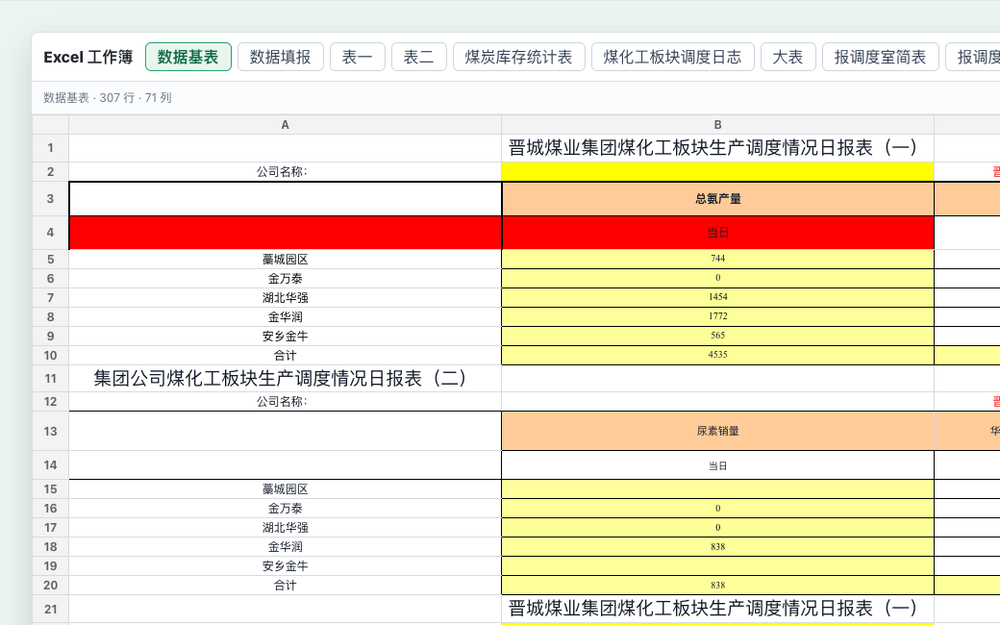

<div align="center">
  <a href="https://demo.flyfish.group">
    
  </a>

  <h1>Office Preview JS</h1>

  <p>
    面向 Word、PowerPoint、Excel 的高还原度 Office 在线预览静态成品包。
  </p>

  <p>
    <a href="https://demo.flyfish.group"></a>
    
    
    
  </p>

  <p>
    <a href="./README.md">English</a> · <strong>简体中文</strong>
  </p>
</div>

---

## 概览

Office Preview JS 是 Flyfish Office Preview 产品线的公开静态成品仓库。当前仓库包含已经构建好的浏览器端产物，可用于在静态托管环境中评估 Office 文档在线预览效果。

在线演示：

[https://demo.flyfish.group](https://demo.flyfish.group)


## 官方入口

| 入口 | 链接 |
| --- | --- |
| 在线演示 | [https://demo.flyfish.group](https://demo.flyfish.group) |
| 产品介绍 | [https://product.flyfish.group](https://product.flyfish.group) |
| 飞鱼低代码平台 | [https://dev.flyfish.group](https://dev.flyfish.group) |
| 飞鱼小铺 / 购买 | [https://dev.flyfish.group/shop](https://dev.flyfish.group/shop) |
| 博客 | [https://blog.flyfish.dev](https://blog.flyfish.dev) |
| 文件预览产品线 | [https://viewer.flyfish.dev](https://viewer.flyfish.dev) |
| 代码仓库 | [https://git.flyfish.dev](https://git.flyfish.dev) |

## 支持格式

- Word: `.doc`, `.docx`
- PowerPoint: `.ppt`, `.pptx`
- Excel: `.xls`, `.xlsx`

## 主要特性

- 纯前端静态部署，无需后端转换服务。
- 按文档类型按需加载 WebAssembly 与 JavaScript 分块。
- 支持 Word、PowerPoint、Excel 文件的浏览器端预览体验。
- 内置样例文档，便于快速进行本地验证。
- 支持本地上传、格式识别和调试信息查看。
- 使用文档风格的加载状态，清晰展示渲染进度。
- 公开 Demo 使用面向演示环境的授权构建。

## 运行截图

以下截图复用自 Flyfish Office Preview 产品页，用于快速了解实际预览效果。

| Word 文档预览 | PowerPoint 演示预览 | Excel 表格预览 |
| --- | --- | --- |
|  |  |  |

## 快速开始

本仓库是构建后的静态产物，直接在仓库根目录启动静态服务即可：

```bash
python3 -m http.server 5178 --bind 127.0.0.1
```

然后访问：

```text
http://127.0.0.1:5178/
```

也可以使用任意静态文件服务器部署，例如 Nginx、Cloudflare Pages、Netlify、Vercel 或企业内网静态服务器。

当前公开演示构建用于：

```text
https://demo.flyfish.group
```

如需生产使用、私有化部署、增加授权域名或源码交付，请购买匹配的商业授权。

## 部署说明

- 必须完整上传根目录下的 `index.html`、`assets/`、`wasm/`、`samples/`、`favicon.png` 等文件。
- `.wasm` 文件需要使用 `application/wasm` MIME 类型。
- 请保持相对目录结构不变。
- `samples/` 用于评估验证，生产接入时可替换为业务自己的文件入口。
- 如果通过 Nginx、CDN 或企业网关部署，请确保 JavaScript、CSS、WASM 和样例文件不会被响应头策略拦截。

## 授权说明

本仓库仅包含用于评估的构建产物。仓库公开不代表授予开源许可、商业使用许可、私有化部署许可、二次分发许可或源码访问权限。

商业使用、私有化部署、授权域名开通、二次分发、源码交付和定制集成均需单独书面授权。

详情请查看 [LICENSE](./LICENSE)。

## 联系我们

如需购买授权或企业集成，请联系：

- 飞鱼小铺：[https://dev.flyfish.group/shop](https://dev.flyfish.group/shop)
- 微信客服：`Yous_Gift`
- 售后邮箱：[wybaby168@gmail.com](mailto:wybaby168@gmail.com)
- 商务邮箱：[727842003@qq.com](mailto:727842003@qq.com)
- 在线 Demo：[https://demo.flyfish.group](https://demo.flyfish.group)
- 产品介绍：[https://product.flyfish.group](https://product.flyfish.group)

建议在沟通时提供部署域名、需要支持的格式、部署环境、预估文件大小和日访问量，便于评估交付方案。

| 客服微信 | 公众号 |
| --- | --- |
|  |  |
